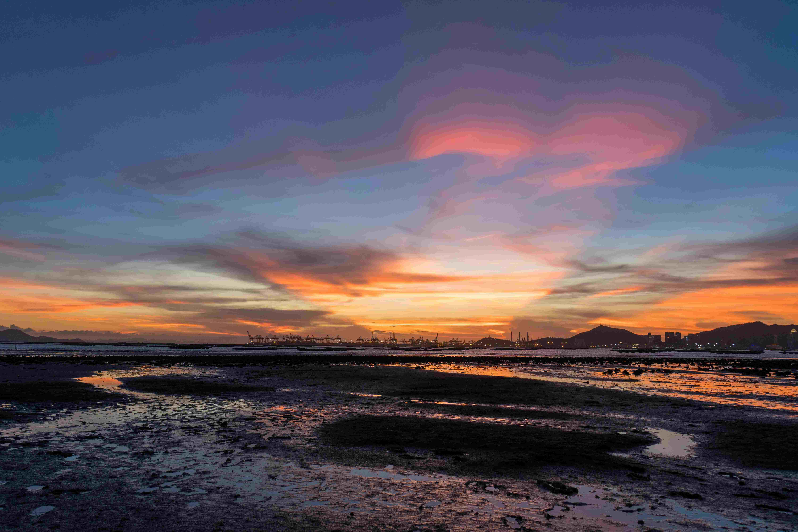

# One of the awesome sunset from Hong Kong

暮色如诗，当香港的晚霞铺展在天际，世界仿佛被浸入了一眸温柔的光凝。画面中，天空是梦幻的色彩拼图，深蓝与橙红交织，粉紫如绸缎般缓缓舒展，云层被夕阳晕染成流动的虹光，每一缕光线都似在悄然编织城市的梦境。地平线处，港口的巨轮与吊机群落，在暮色中成为工业文明的剪影，而远处山峦的轮廓，则为这片港湾增添了几分苍郁的诗意。  

滩涂与海面交织的群落，在日落时分流露静谧的质感。水流被晚霞晕染上暖唐的橙红，与天空的色调柔美呼应，泥沙与水洼的细碎反光，如散落的碎金，将天地间的暖意揉进每一道纹理。光影在此变得温柔，辉光在湿润的地面轻舞，仿佛城市的呼吸，于暮色中沉淀出历史的厚度。  

香港的地理，是海洋与山脉共同缝就的篇章。这片港湾的日落，见证了城市从渔村到国际大都会的蜕变，也承载着自然与人文交织的独特韵味。当暮色将都市与自然晕染成一体，我们看见的是香港的底蕴——既有山海间唤起的诗意情怀，也有港口边上跳动的经济脉搏，而这一次震撼的日落，不过是这座城市永恒叙事里，一段关于黄昏与梦想的深刻注脚。