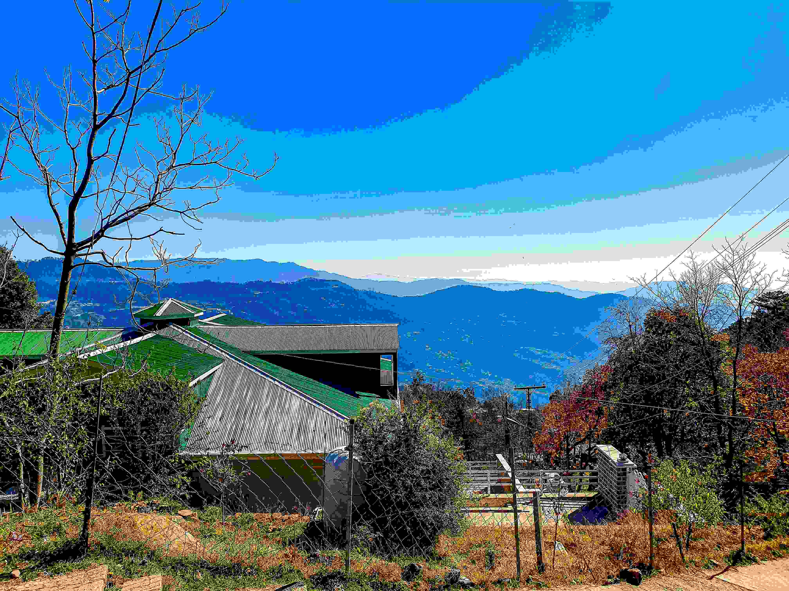

# A View of the Mountains from the Top of a Hill

在阳光将山巅织物般铺展时，远处的山峦如在澄澈的蓝绸上叠印着层层的青色华章。光影如丝线，于建筑与山野之间勾勒出明暗的韵律，银白的屋面与墨绿的屋顶在晴空下折射出清亮的反光，与远处山峦的蓝调相融，构成一场色彩的盛宴。画面中，近景建筑线条利落，屋角与屋檐在光影间舒展，宛如自然与人文交融的载体；树木或疏朗或繁茂，枝干轮廓在明净空气中格外清晰，似大地馈赠的艺术。远处山峦被薄雾轻笼，层次随视线渐次朦胧，蓝调递进间，山野的辽远与深邃悄然漫入心底，每一道山脊都像时间刻下的纹路，诉说着地理与岁月的故事。

这般视角下，山间建筑与自然的共生成为地理文化的生动注脚。这片山地孕育的建筑，大概率遵循当地对山水秩序的认知——屋宇高低错落与地势呼应，屋顶色彩与植被相映，恰是山地文明与自然共处时的诗意表达。山峦轮廓与云烟交错，如同自然写下的永恒符号，在晨昏间为山地景观镀上文化底色，让山居者的智慧在光影与地貌间永远闪烁。每一道光影、每一种色彩、每一处构图，都成为连接地理与文化的纽带，诉说着此地山水的常青故事，也让自然之美与人文脉络永远交织于这片天空与山峦之间。