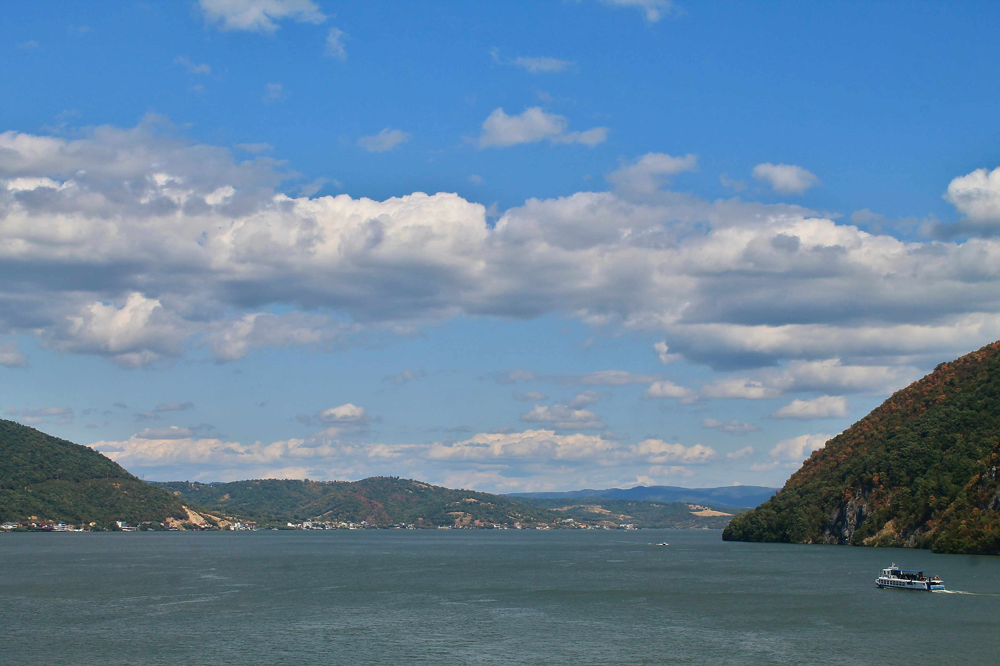

# 小锅洞：多瑙河上的地理诗行

从高空俯瞰，小锅洞处多瑙河如一片被温柔托举的镜面，天空将澄澈的蓝晕染得愈发舒展。棉絮般的云朵悠绽于穹顶，光影在云层缝隙间摇曳，为河面添上一缕柔缓的金芒。两岸山体如翠绿色的臂弯，簇拥着蜿蜒的河水，左为罗马尼亚，右为塞尔维亚，边界在自然肌理中悄然分野却又彼此相连。  

河水的色调如黛色绸带，荡漾着沉静的韵律；山体上植被色彩层次分明，深浅交织的绿意与初染暖黄的秋意，构成恒久的风景诗。远处山峦连绵成画，似把历史的故事收入缥缈天际；近处河面，一艘舟船缓行，粼粼波光如人文与自然对话时的温柔注脚。  

这片土地，是地理与文化的深度纽带。多瑙河作为中西方的文明脉络，在此沉淀了罗马尼亚与塞尔维亚共同的文化基因——那些关于河流的传说、民族迁徙的史诗，都融于这片水岸。小锅洞不只是一个地理分界点，更是文明对话的见证：当云朵在蓝天游走，当河水静静流淌，时光将不同民族的脉络悄然串联，让自然与人文的共鸣在风里久久回荡，成为跨越地理的永恒诗行。