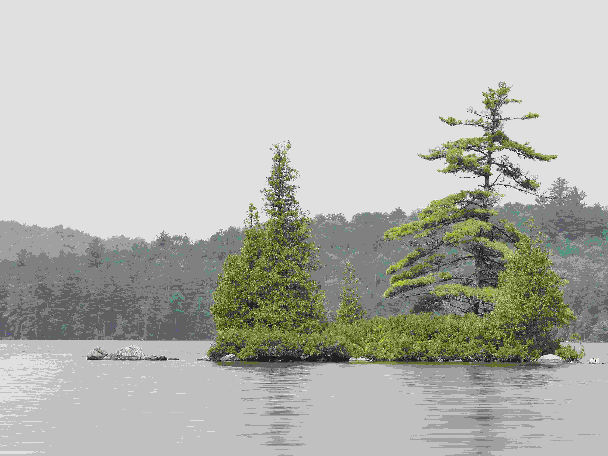

# 湖心的绿屿沉响  

湖水如蒙淡墨的镜面，平整地铺展，将岛屿的轮廓清晰映出。岛上的树影间，光影如轻纱漫过，高大的松枝舒展如时光织就的伞盖，浓绿的枝叶在灰调的天气里尤为醒目，像从岁月褶皱中弹出的鲜亮绿意。周围的矮林与灌木，以墨色晕染出朦胧的边缘，将小岛的生机温柔框定。水面细微波纹，似在轻声咏叹，远处的山林在灰雾中化作朦胧底色，让岛屿宛如从梦境中浮出的迷你大陆，既有孤寂的静美，又被自然以温柔目光拥抱着。  

色彩上，鲜亮的绿意是画面的灵魂，在灰调背景中格外夺目，如自然长期积淀的深情注脚；构图里，岛屿居于视觉中心，湖水与远林构成错落的层次，既有聚焦时的不羁感，又因整体环境的呼应，流淌着平和的秩序。  

这小小的绿洲，是大自然以水为墨、以林为笔绘就的生态长卷。湖水或许由地质变迁形成，岛屿则是时间的载体，每株松针、每簇灌木都承载着森林生态的年轮与变迁。而湖心岛屿的格局，既展现了自然独立却依赖水系的共生关系，也隐喻着人类与天地共生的敬畏与静美。这方小天地，没有喧嚣，却藏着岁月的诗行，是大地写给时间的温柔信笺，让观者于静谧氛围中触摸自然与人文交融的深层韵致。