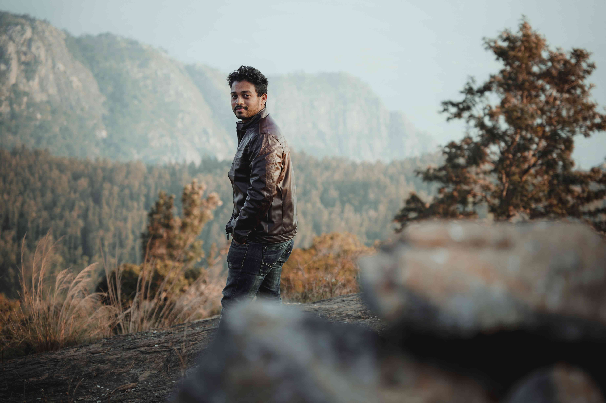

# Man in Brown Jacket: A Dance Between Man and Nature

光影如轻柔的丝绒，轻笼着这片开阔的棕色草场。白昼的阳光以温柔的强度洒落，在草叶与岩石上晕染出细腻的光斑，给每一寸土地都镀上一层暖金。男人身着的棕色夹克，与脚下草场的色调如天然接壤，仿佛与这片疆域生来就有着某种共通的诗意。  

画面的色彩是自然法则的凝练：棕褐是草与石的质感，深绿是山林心底的欲语还休，浅蓝是天空轻漾的宁静，而远处山峦如岁月沉淀的墨灰，在光影里泛着朦胧的温柔。构图的层次让我心生遐想——前景若有若无的岩石边框，将视线引向中景的男子，再延伸至远景的山林与天际，每一层都藏着自然的呼吸与历史的肌理。  

这片土地或许属于山地与丘陵过渡的地理带，林草交织处是自然与人文碰撞的场域。千年间，先民们在此依山而栖，以草木为伴，山峦过滤风雪，草场孕育生机，人与山河彼此成全。此刻男人伫立的姿态，既是与自然对话的瞬间，也是古老地理文化赋予生命共鸣的注脚。阳光穿过树叶间隙时，时光在此定格为一个关于存在、宁静与共生的注解，让观者于视觉与想象间触摸到那片土地上沉积的地理与人文记忆。