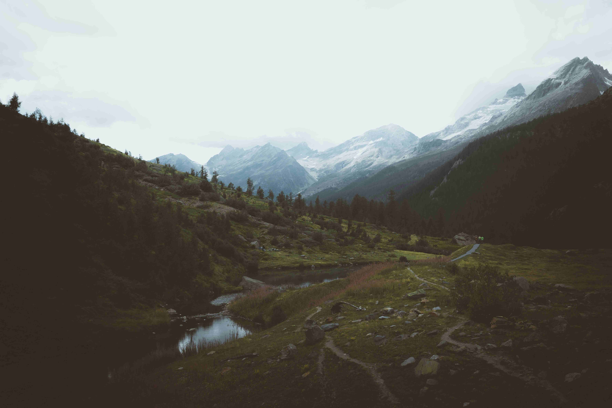

# Green Grass Field and Mountains During Daytime

轻柔的光线如岁月的绢纱，轻覆这片繁茂的天地。生机盎然的草地，在日光的晕染下，化作层次丰富的绿意织锦。近处草地的嫩绿如初醒的春梦，与远山若有若无的灰蓝交融，似大自然倾倒的颜料盘，晕开朦胧的诗意边界。光影在山谷间穿梭，草叶上的微光跃动如星，而远山在薄雾中廷展开轮廓，山顶的积雪泛着银白的清冷，似古今交织的光影锁。  

画面的构图如一首节奏丰富的交响诗，草地是活力四溢的前奏，蜿蜒的小径似时光的脉络，延伸向那被云雾轻拥的峰峦；溪流的倒影成为自然馈赠的镜面，将天空、山脉与草地打包成永恒的瞬间，让天地在此刻共舞成诗。  

这片天地藏着时光的密码：山的褶皱记录着百万年的地质变迁，草地的蓬勃承载着人类与自然的共舞脉络。在文化与自然的交响里，草地曾是游牧文明的温床，山脉是世代图腾的精神坐标，当阳光穿透云层，不仅是视觉的盛筵，更是文化记忆在风里的回响。千百年前，先人们曾踏着这方寸草地、仰望这片群峰，把对山的敬畏、对生命的眷恋，深深刻进大地的肌理。  

如今，当脚步踩过青草、风掠过山尖时，我们仍能触摸到古往今来人与自然对话的余温。而光影、色彩与地貌交织的诗章，正诉说大地无声的故事，与人类心底的诗意掀起温柔的共鸣。