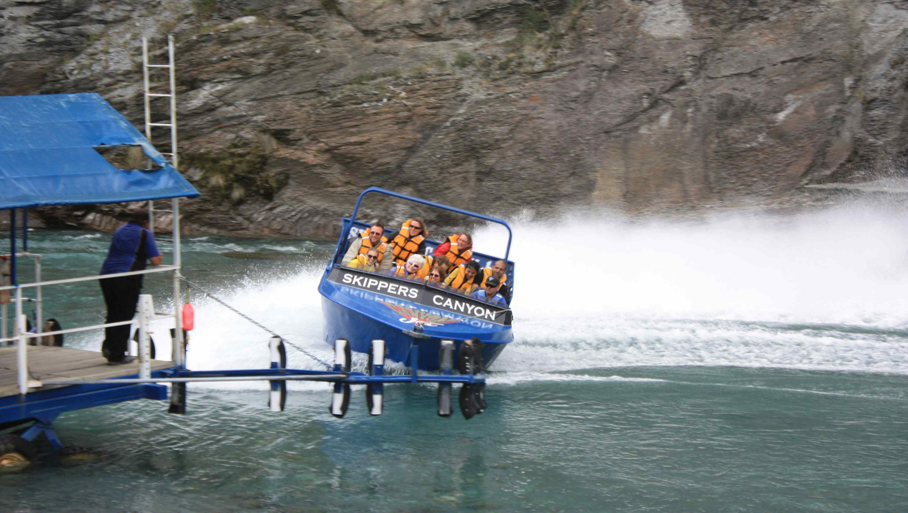

# Shallow river high speed boating at Skippers canyon near Queenstown, New Zealand

阳光轻洒在萨巴林峡谷的岩壁上，浅河成了一块承载自然史诗的画布。画面里，蓝黑色的高速船如跃动的钢影，载着身着橙黄救生衣的旅人，在青碧的水面上劈开一道耀眼白浪。船体与水面的夹角充满张力，喷溅的水雾化作朦胧银白，与深褐灰调的岩壁形成强烈对比——岩石肌理沧桑，在光影中藏着地质历史的史诗密码；河水的青绿因船的高速被搅成粼粼碎光，每一道水痕都晕染着冰川雕山、河流塑谷的旧梦。  

这浅河本是平平的水域，却因高速船的冲刺，化作人与自然倾心对话的舞台。Skippers canyon的诞生，源于冰川时代的冰流切割与岁月洄流的雕琢，方孕育出这般惊心动魄的地质奇观。而高速船旅游项目，恰是自然遗产与现代体验的联结纽带，让旅行者以心跳丈量峡谷的岁月，也令远古地质力量复现于现代感知的共鸣之中。船弦溅起的水花，不止是速度的故事，更是冰川褪去后河流持续倾诉的万丈时光；乘客们紧绷与欢呼交织的心情，更是人类对自然野性之美的敬畏与沉醉。此地，水不再是沉默的镜面，而是时光冲刺的跑道，每缕光影都在诉说地质的壮阔与人类探索的勇气，将自然与人文交织成一场震人心魄的邂逅。