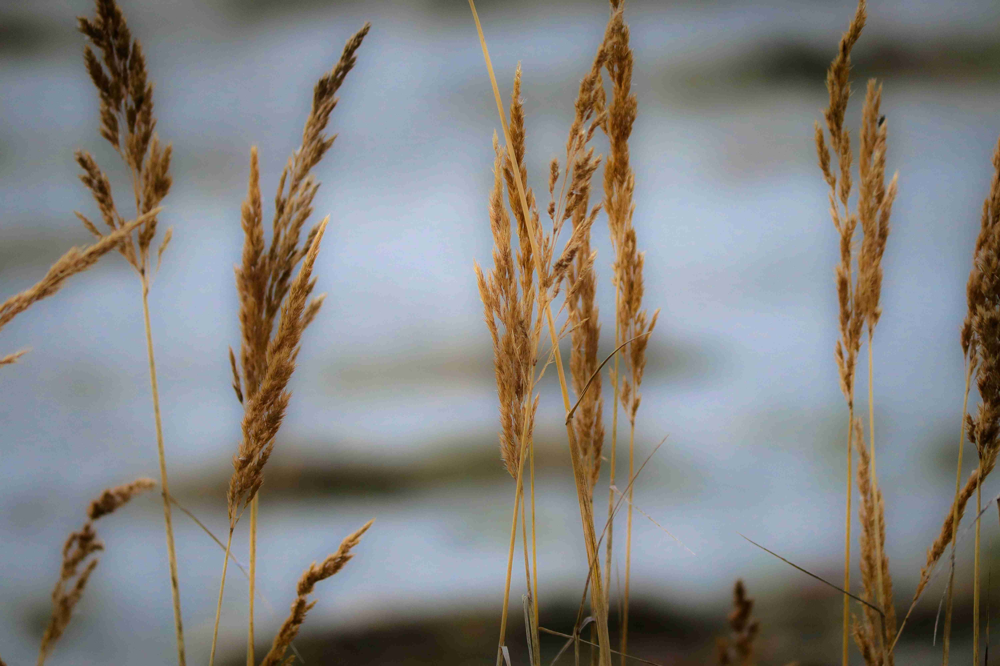

# Brown Wheat in Close - Up Photography  

当特写镜头轻触棕褐的麦穗时，时光仿佛慢成了一阵温柔的呼吸。光影如轻柔的纱衣，裹住麦秆与穗头，给每一缕纤细的绒毛镀上一层暖金，暖调的微光在麦芒间跳跃，让深褐与浅褐交织出浓郁的深邃，却又因柔和的光线漾开温婉的暖意。画面中，麦穗如灵动的脉络，在朦胧的背景前自然舒展，构图既捕捉了生命最微贱的细节，又营造出蓬勃的呼吸感——细长的茎秆、错落有致的穗头，在光影的轻抚下，成为自然神秘的诗意注脚。  

这些棕褐的小麦，见证着地理与文化的双重脉络。它们生长于一方土地，或塬野的田垄，或荒漠的边缘，土地的温差、雨量的分层，塑造了它们色泽与姿态。在地理维度上，这或许是旱地小麦的写照，干旱土地教会小麦以坚韧的茎秆、饱满的穗头，对抗岁月与自然的考验；而在文化层面，小麦是无数文明的主粮缩影，从古至今，它的颗粒滋养着人类生命，成为节日祈福、生活仪式的核心符号。当人们凝视这些麦穗的特写时，也在触摸历史——无数代农人在这片土地上劳作，让小麦成为土地与人性共生的见证者，承载着人与土地千年的羁绊与敬畏。  

棕褐色的麦穗，在光影与色彩的交织里，既是个体生命的蓬勃绽放，也是地域文化的无声注脚。它们沉默伫立，却向世界诉说自然赠予的温柔，以及在岁月长河中人与土地共生共长的深情。