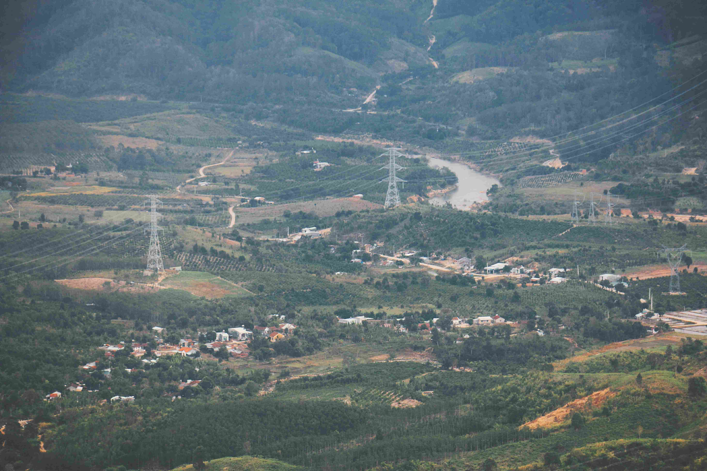

# An Aerial View of a Valley with a River Running Through It

从高空俯瞰此境，山谷如被轻柔时光晕染的秘境。光线似细碎的金箔，在山峦与林木间铺展，为这方天地蒙上一层面纱般的温柔。河流则是银灰丝带，在翠绿与褐黄的层峦间蜿蜒蛇行，如自然信手画就的灵动脉络。色彩的交响格外动人心魄——深墨的森林渐次晕开为葱郁的绿意，村落与农田则点缀着暖沙的绵柔、土墙的赤褐，每一抹色调都承载着大地生存的肌理与岁月痕迹。构图如一首静默的田园史诗，河流为经、村落为纬，连缀起山脊、森林与农田，而那些电线塔如竖立的诗行，在自然野逸与文明秩序的边界处，悄然划出人类与天地共振的注脚。

这片山谷的地理脉络里，河流是文明初始的摇篮。水流滋养蓬勃的植被与土壤，孕育出错落的村落、金黄的田园与葱郁的林木，而人类在这片土地上沉淀的生存智慧，如星子般散落在溪流与房舍之间。当视线落向蜿蜒的河流与棱角分明的电线塔时，仿佛听见历史与现实的对话——水从远古流淌至今，灌溉文明，也赋予这片土地诗意；而现代文明的脉络（电线、塔架）以理性的姿态嵌入，成为连接传统与未来的桥梁。每一处光影的明暗、每一抹色彩的交融，都呼吸着这片土地的脉搏：自然的慷慨与人类的渴望在此达成和鸣，山谷借此成为文明传承与生态共生的故事场域，让时间在河流与山峦间，沉淀为岁月酿就的沉香。