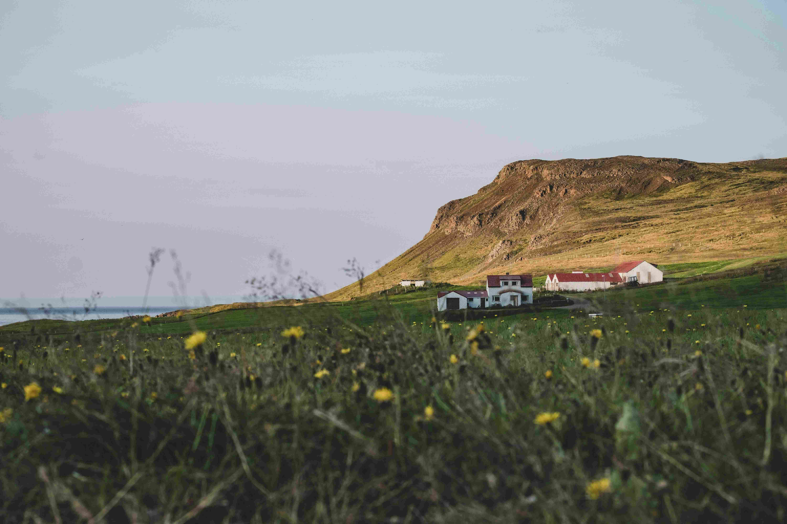

# The House Amidst Prairies and Mountains  

在广袤的草野中央，几处房屋静静伫立，红顶白墙在柔光下泛着温润的光泽。近处的草地似绿毯般舒展，点缀着淡黄野花，光影如细碎的金箔，在草叶间轻轻跃动。远处的山岩巍峨耸立，土褐与苍绿交织，像大地跳动的肌理，被薄雾轻笼，添了几分朦胧的诗意。天空是淡紫与浅蓝的渐变，柔和得如蒙上半透明的纱幔，为整幅画面蒙上了宁静的滤镜。构图上，房屋以小巧的形态成为开阔草野的视觉中心，山脉如天然的屏风，将天地间的诗意与岁月凝于方寸之间。  

这间坐落于田野中央、背靠山脉的房屋，是自然与人文共生的缩影。那里的土地承载着百年风土的积淀，山脉见证过冰川刻痕、火山奔涌的壮阔历史，而房屋里的人们以敬畏与热爱，与土地展开了永恒的对话。这种地理与文化的交融，是自然骨架上生长的人文肌理——房屋不仅是栖身的港湾，更是文明脉络的延伸；山脉是自然史诗的刻痕，而人们以简朴且坚韧的生存智慧，将历史融进每片草地、每道岩壁、每间房屋。凝望着这温柔的场景，能感受到人与天地共生的雕塑感，每一缕风都藏着历史的回响，每一寸草地都守着人文的眷恋。在此处的天地与人心交织里，文化不再是遥远的故事，而是土地与人心呼吸共生的注脚，在这片草野与山脉的怀抱中，时光轻缓，而文明与自然的情愫，正静静流淌在历史的肌理里。