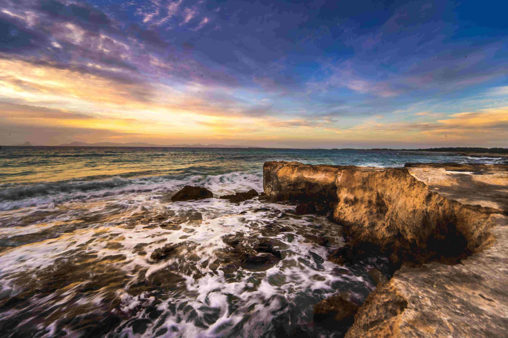

# Sunset's Embrace: Ocean Waves against the Rocks

在落日的温柔私语中，海洋与岩石共谱一场动静交织的诗意乐章。天空被晕染成绚烂的渐变色块：地平线处那抹橙金如熔化的蜜糖，从暖橘向澄澈的蓝紫缓缓延伸，云朵似被夕阳揉成粉橘与靛紫的绒毯，任金辉轻吻每一道纹理。海浪如银白絮带，裹挟着蓬勃动能，拍打着古旧岩石的棱角——岩石经岁月与浪涛雕琢，表面粗糙却承载着时光沉淀的肌理，在夕阳暖光里泛着暖金色，仿佛从海涛的历史里积淀出的不朽见证。  

光影是这场自然画卷的无形指挥：暖金色为浪涛镀上圣洁辉光，冷调暮色为天空漾开静谧底色，海浪与岩石的碰撞化作震颤的韵律，泡沫翻涌处，生计与生命的气息悄然交融。这般景象，绝非单纯的自然景观，而是地理与人文交织的注脚——这片海岸经千万年海浪侵蚀与沉积，塑造出独有地貌；世代依海而居的人们，从渔人打渔到沿海生活，在浪涛与岩石间沉淀出对自然的敬畏与共生智慧。早在文化萌芽时，他们便以海为师、以浪为图，将海洋韵律注入歌谣与传说，岩石与海浪的对话，成为精神传承与生活哲学的具象表达。  

这一瞬的光影、色彩与碰撞，是海洋永恒的呼吸，亦是文化与自然对话的永恒乐章。每一道浪痕都藏着岁月的故事，每一块岩石都承载着自然的记忆，而夕阳的余晖，为这场永恒对话镀上温柔又深邃的诗意注脚。