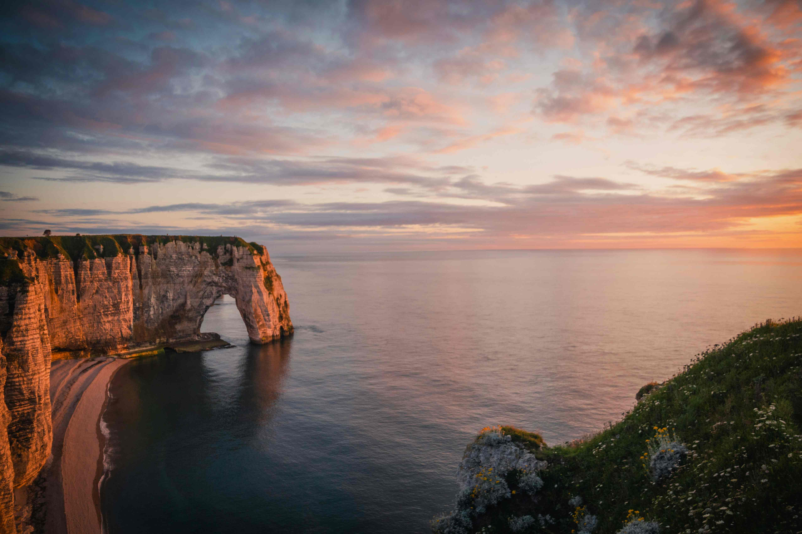

# 岩海间的时光诗章  
当暮色的柔光轻吻这片海岸，棕褐与葱郁的岩群在时序的脉络中悄然舒展。画面里，岩石的纹理如时光的褶皱，褐色的肌理间藏着风与浪千万年的雕琢之痕；而附着其间的绿色植被，恰似大地那抹鲜活的笔迹，在风蚀岩壁上漾开生机的轮廓。阳光如暖金纱帘，为岩石镀上柔和光辉，在灰蓝时空中晕染出梦幻的层次。海面如镜，映着天空与岩石的色晕，将天地间的层次缕成一幅流动的画，光影在海面上漾开粼粼波光，与岩石的轮廓交织成自然的诗章。  

这片海岸的岩层，是海陆共生的地质史诗。风浪以千万年的时间，以侵蚀与沉积为笔，雕筑出独特的拱门与峻峭崖壁；而植被的附着，则为这刚硬的岩石注入温柔的注脚——它见证着海洋变迁的韵律，也承载着古人逐浪、依海而生的人文故事。灰云似岁月的幕布，此时却被晚霞晕染成暖调的墨色，恰如时光在天地间轻缓的呼吸。当光影落在这岩海间，我们仿佛看见千万年时光的波纹，在风与浪的诉说中，沉淀成一处自然与人文相拥的地域记忆。